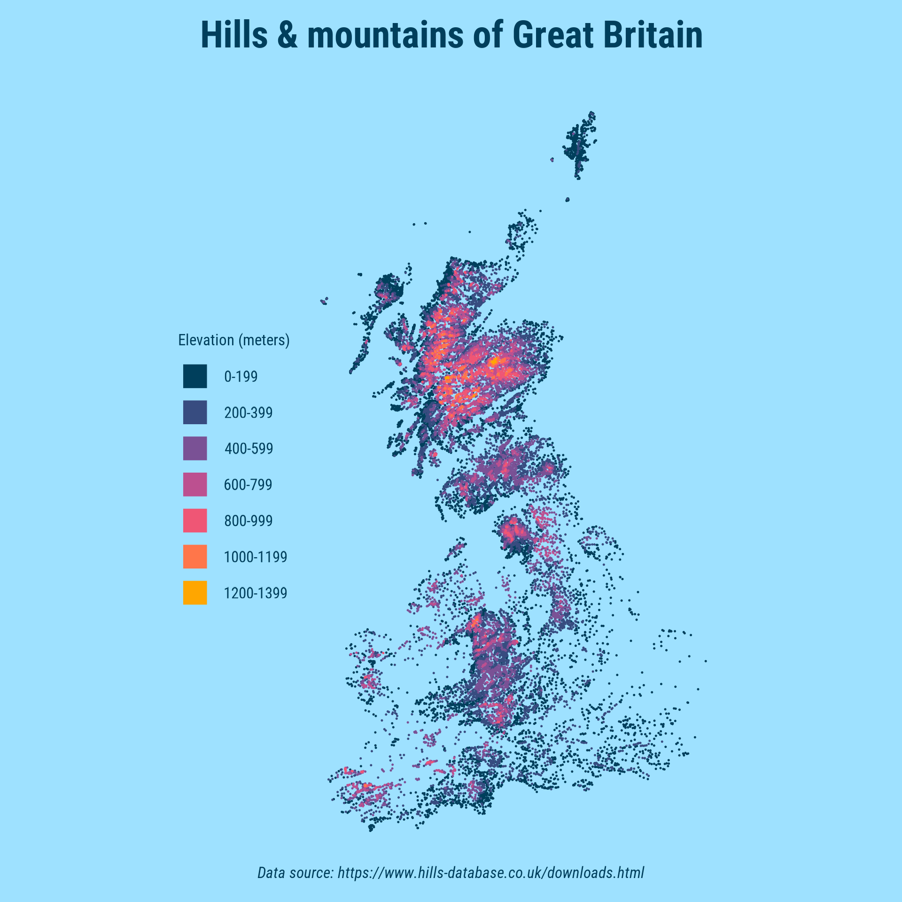
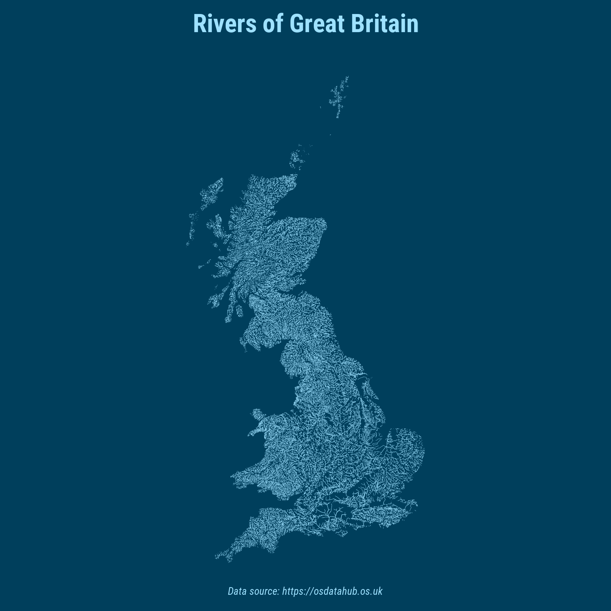
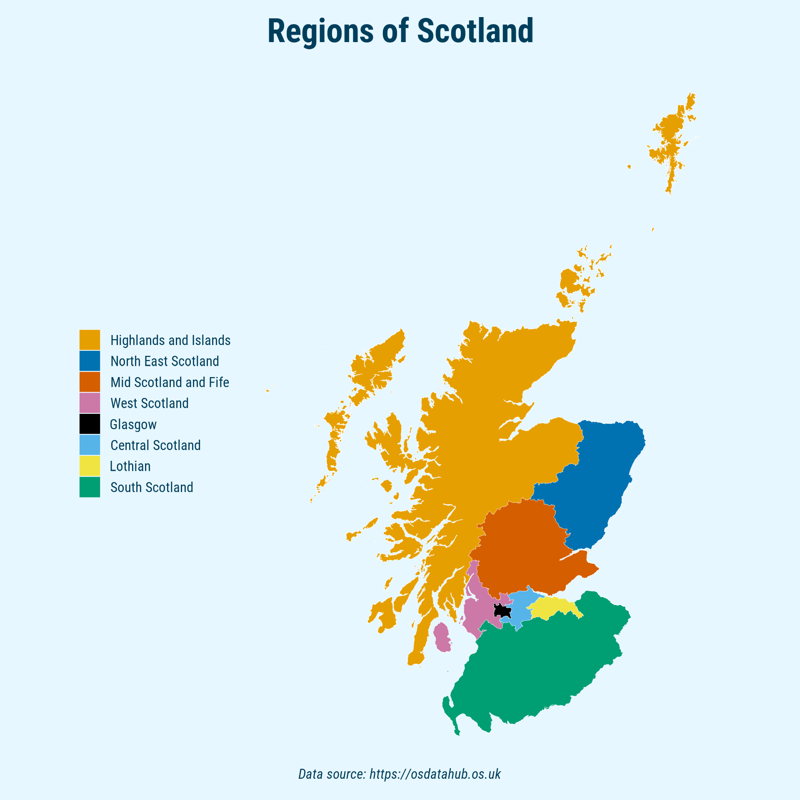

# 2024 30 Day Map Challenge

Here, you'll find the code I used to create a few maps for the 2024 [30 Day Map Challenge](https://30daymapchallenge.com/).

My contributions for the #30DayMapChallenge in 2024:

### Day 1 (Points)

### Day 2 (Lines)

### Day 3 (Polygons)

